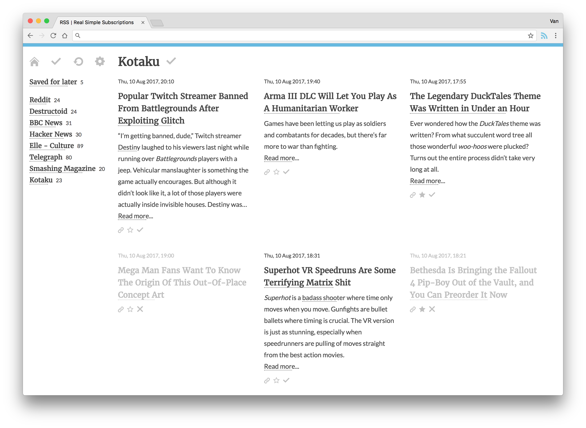
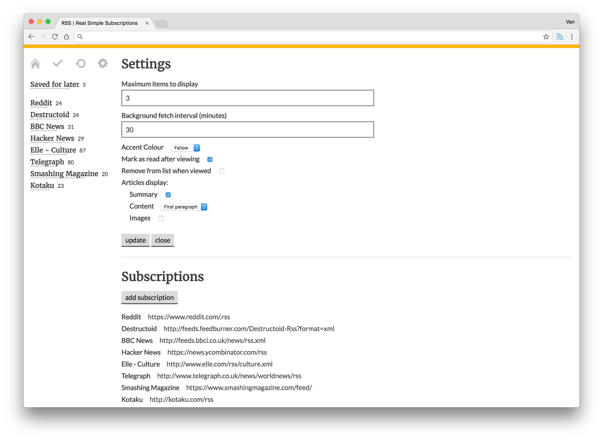

# Real Simple Subscriptions 

A Chrome extension that replaces your 'new tab' pages with the latest news from your chosen RSS feeds.

This extension is currently unlisted in the [Chrome Store](https://chrome.google.com/webstore/detail/real-simple-subscriptions/lapbjbhplohhcfhmcmgpenfkchkclajo) whilst it's still a work in progress.

---

##### Setup

Clone, then run `yarn install` to install dependencies. Serve the app with `yarn start`.

##### Build

Run `yarn build`, then load the `/build` directory as an unpacked extension in Chrome.
